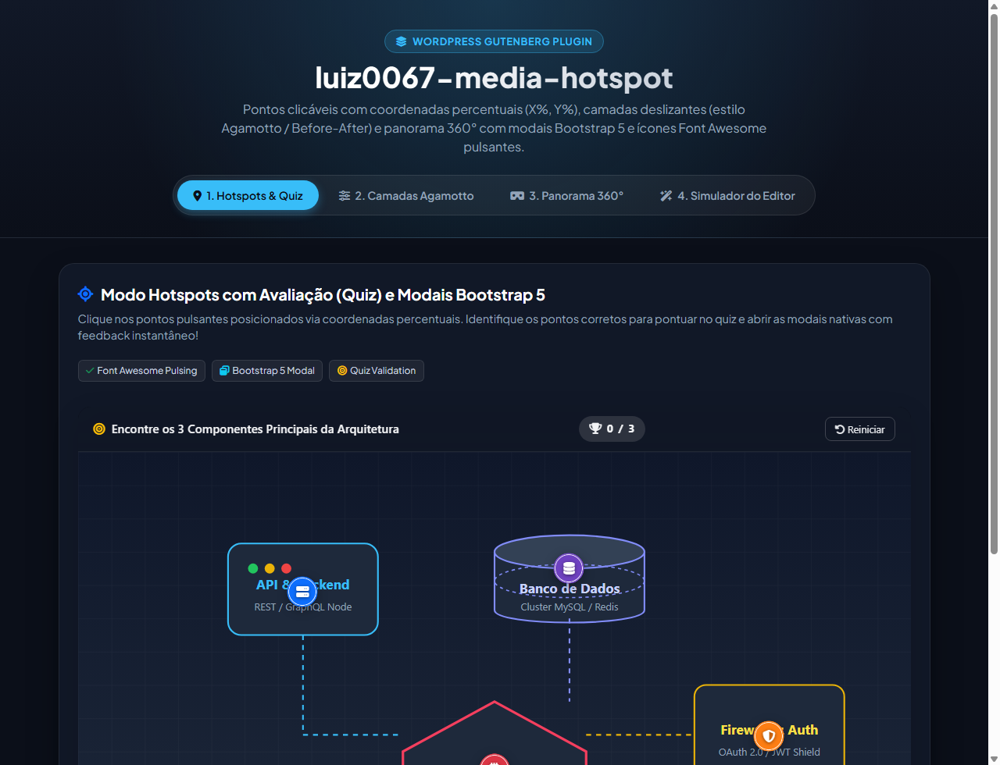

# luiz0067-media-hotspot

[](https://wordpress.org)
[](https://developer.wordpress.org/block-editor/)
[](https://getbootstrap.com)
[](https://fontawesome.com)
[](LICENSE)

Plugin de bloco Gutenberg avançado para WordPress desenvolvido seguindo a **arquitetura luiz0067**. Apresenta mídias interativas com **Pontos Clicáveis (Hotspots)** em coordenadas percentuais (`X%`, `Y%`), **Camadas Deslizantes (estilo Agamotto / Before-After)** e **Panorama 360° Interativo**, acompanhados de modais nativas Bootstrap 5, marcadores Font Awesome pulsantes em CSS e suporte completo a internacionalização (i18n).

---

## 📸 Demonstração Visual (Screenshot)

<p align="center">
  
</p>

---

## ✨ Funcionalidades Principais

### 1. Pontos de Interesse Clicáveis (Hotspots) & Modo Quiz
- **Fixação Direta no Editor (`edit.js`)**: Clique em qualquer ponto da imagem no editor Gutenberg para calcular e fixar automaticamente as coordenadas percentuais (`left: X%; top: Y%`).
- **Ícones Pulsantes em CSS**: Efeito de ripple/pulso contínuo (`@keyframes luiz0067-pulse`) ao redor de cada marcador, com ícones Font Awesome personalizáveis e cores configuráveis.
- **Modais Nativas Bootstrap 5**: Cada ponto abre sua janela modal correspondente (`modal fade`, `modal-dialog-centered`), com título, descrição detalhada e fallback leve vanilla JS incluso no `view.js`.
- **Validação Avaliativa (Quiz / Teste)**:
  - Configure alvos como corretos ou incorretos (`isCorrectTarget`).
  - Barra superior de pontuação com contador dinâmico e botão de reinício.
  - Feedback visual imediato (verde para acerto com animação de bounce, vermelho para erro com tremor) e síntese sonora nativa via **Web Audio API**.

### 2. Camadas Deslizantes (Estilo Agamotto / Before-After)
- **Sobreposição Multicamadas**: Exiba desde 2 até N camadas sobrepostas (esboço, pintura final, visão raio-x/térmica, progressão temporal histórica).
- **Controle Deslizante Suave (Range Slider)**: Interpolação contínua de opacidade entre camadas adjacentes.
- **Rótulos Dinâmicos**: Exibição em tempo real do nome da camada ativa conforme o cursor do slider é arrastado.

### 3. Visualizador de Panorama 360°
- **Projeção Cilíndrica/Equirretangular Contínua**: Renderização direta em HTML5 Canvas com rotação horizontal de 360 graus.
- **Navegação por Arraste**: Suporte fluido a mouse (desktop) e gestos de toque (mobile).
- **Controles Integrados**: Botão de rotação automática suave (`auto-rotate`) e botão para centralizar/redefinir o ponto de vista (bússola).

---

## 📦 Estrutura de Arquivos

```text
luiz0067-media-hotspot/
├── block.json                       # Metadados do bloco Gutenberg v3
├── build.js                         # Compilador esbuild + Sass
├── package.json                     # Scripts e dependências NPM
├── luiz0067-media-hotspot.php       # Ponto de entrada do plugin WordPress
├── screenshot.png                   # Captura de tela em alta definição
├── preview.html                     # Vitrine interativa independente (Showcase)
├── languagens/                      # Dicionários de idiomas solicitados
│   ├── pt-br.json                   # Português do Brasil
│   ├── en-us.json                   # Inglês (US)
│   ├── It.json                      # Italiano
│   ├── it.json                      # Italiano (lowercase)
│   └── es.json                      # Espanhol
├── languages/                       # Textdomain padrão WordPress
│   ├── pt-br.json
│   ├── en-us.json
│   ├── It.json
│   ├── it.json
│   └── es.json
├── src/
│   ├── index.js                     # Registro do bloco com registerBlockType
│   ├── edit.js                      # Interface WYSIWYG com clique direto na imagem
│   ├── save.js                      # Marcação HTML estática com modais Bootstrap 5
│   ├── view.js                      # Controlador frontend (quiz, slider, panorama, som)
│   ├── i18n.js                      # Utilitário de tradução dinâmica
│   ├── style.scss                   # Estilos frontend (animações de pulso, slider, panorama)
│   └── editor.scss                  # Estilos específicos do editor Gutenberg
└── build/                           # Artefatos compilados para produção
    ├── index.js                     # Script do editor empacotado
    ├── index.css                    # CSS do editor compilado
    ├── view.js                      # Script frontend empacotado
    └── style-index.css              # CSS frontend compilado
```

---

## ⚙️ Atributos do Bloco (`block.json`)

| Atributo | Tipo | Padrão | Descrição |
| :--- | :--- | :--- | :--- |
| `mediaType` | `string` | `'image-hotspots'` | Modo ativo: `'image-hotspots'`, `'image-slider-layers'` ou `'panorama-360'` |
| `mainImage` | `string` | `""` | URL da imagem principal ou imagem equirretangular 360 |
| `layers` | `array` | `[]` | Array de objetos com as camadas do Agamotto (`{ url, title }`) |
| `hotspots` | `array` | `[]` | Array de hotspots (`{ id, x, y, title, description, isCorrectTarget, feedback, icon, color }`) |
| `showQuizEvaluation` | `boolean` | `false` | Ativa a barra de pontuação e validação de acerto/erro |
| `sliderValue` | `number` | `50` | Posição inicial do controle deslizante de camadas |
| `panoramaAutoRotate` | `boolean` | `true` | Habilita a rotação automática contínua no modo panorama 360° |

---

## 🚀 Instalação e Desenvolvimento

### 1. Clonar o repositório no diretório de plugins do WordPress
```bash
cd wp-content/plugins/
git clone https://github.com/luiz0067/luiz0067-media-hotspot.git
cd luiz0067-media-hotspot
```

### 2. Instalar dependências e compilar
```bash
npm install
npm run build
```

### 3. Modo de desenvolvimento com recarregamento contínuo
```bash
npm run dev
```

### 4. Ativação
Acesse o painel administrativo do WordPress em **Plugins > Plugins Instalados** e clique em **Ativar** no plugin **Luiz0067 Media Hotspot**.

---

## 🌐 Internacionalização (i18n)

Todas as strings do bloco foram extraídas e traduzidas integralmente nos idiomas:
- **Português (Brasil)**: `languagens/pt-br.json`
- **Inglês**: `languagens/en-us.json`
- **Italiano**: `languagens/It.json` & `languagens/it.json`
- **Espanhol**: `languagens/es.json`

---

## 🧪 Testes e Demonstração Rápida

Para testar todos os 3 modos (`Hotspots & Quiz`, `Camadas Agamotto`, `Panorama 360°`) e o **Simulador do Editor Gutenberg**, abra o arquivo [`preview.html`](file:///c:/Users/usuario/Documents/GitHub/luiz0067-media-hotspot/preview.html) diretamente em qualquer navegador moderno.

---

## 📄 Licença

Este plugin é distribuído sob a licença [GPL-2.0-or-later](https://www.gnu.org/licenses/gpl-2.0.html).
