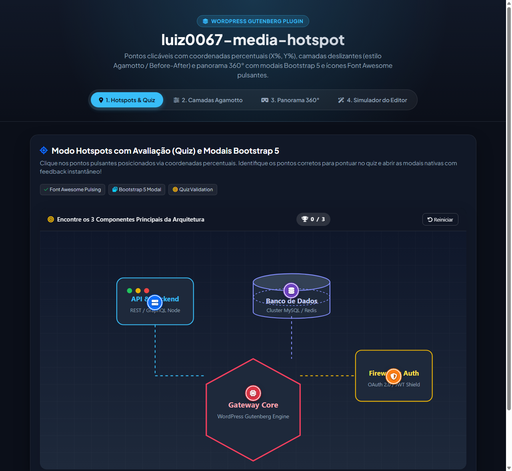
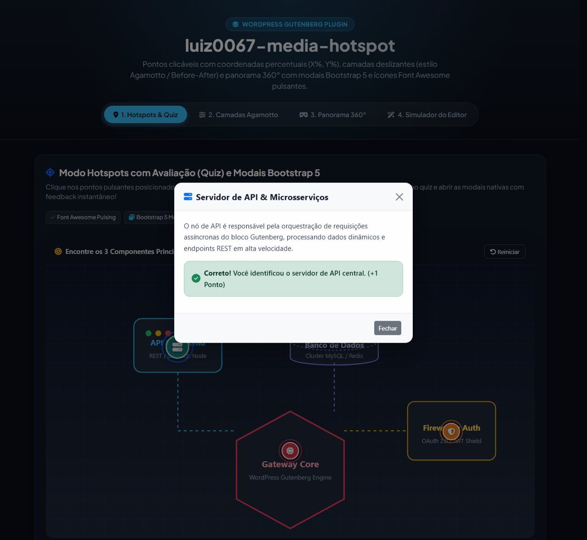
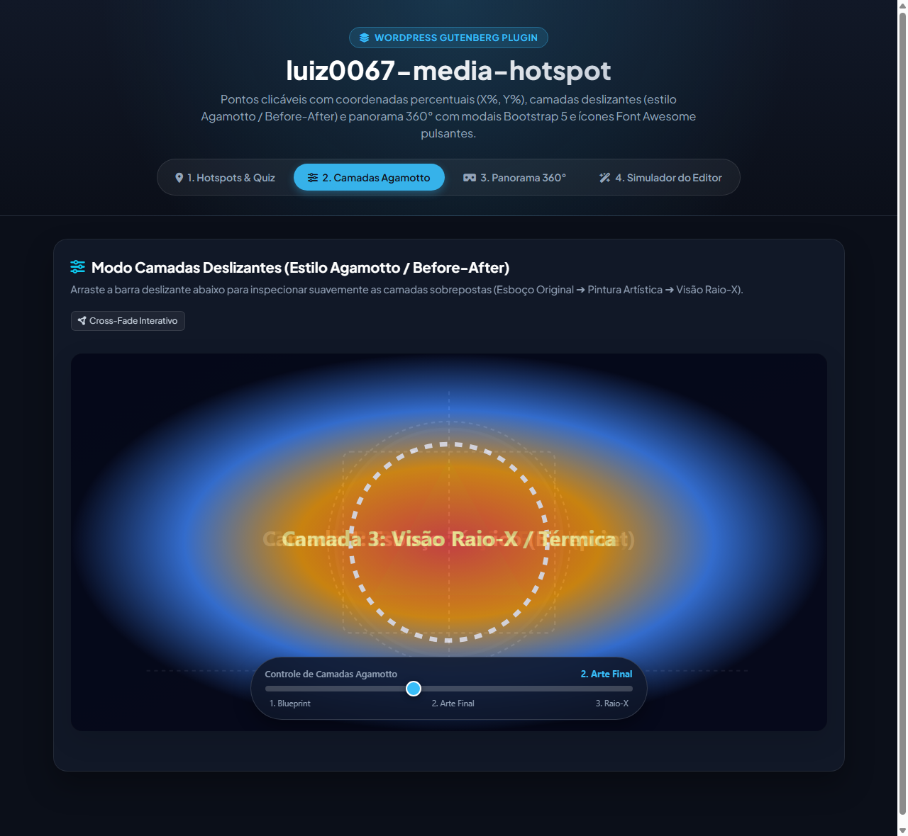
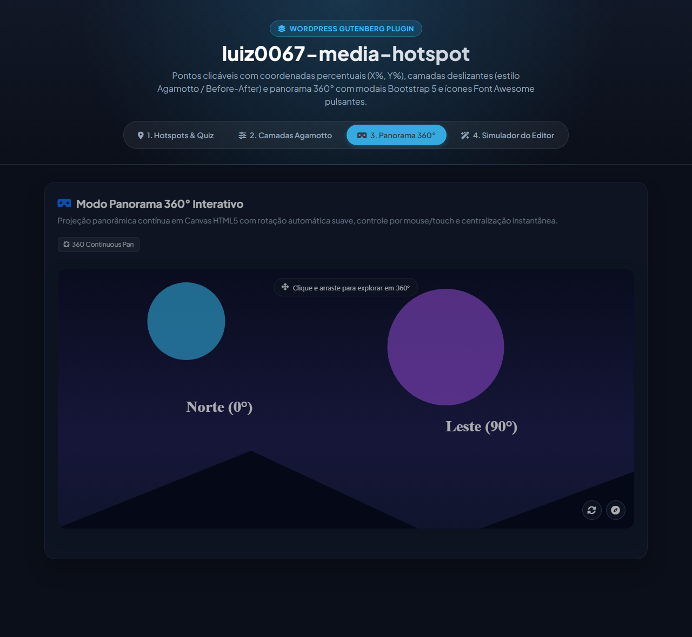
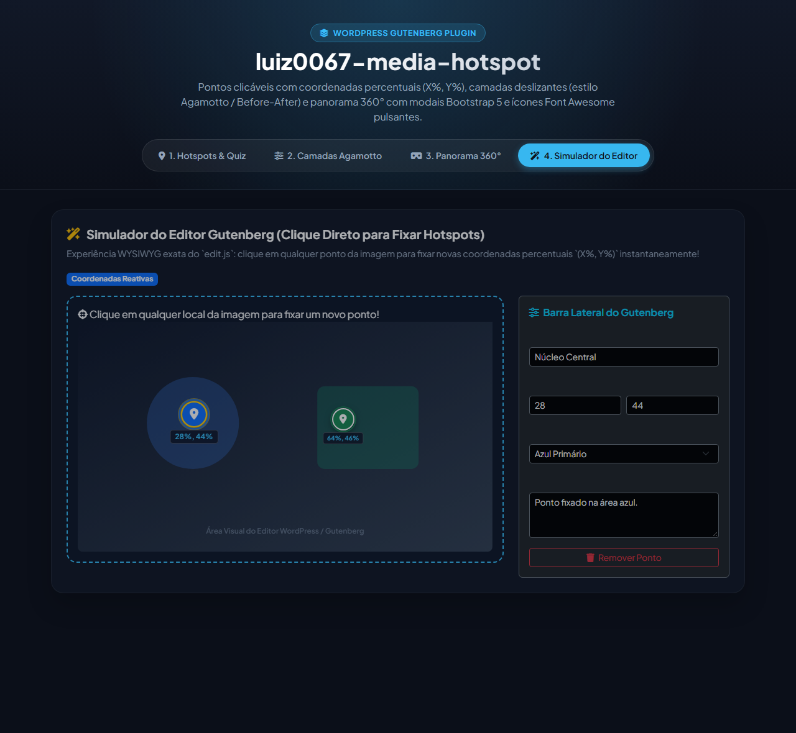

# luiz0067-media-hotspot

[](https://wordpress.org)
[](https://developer.wordpress.org/block-editor/)
[](https://getbootstrap.com)
[](https://fontawesome.com)
[](LICENSE)

Plugin de bloco Gutenberg avançado para WordPress desenvolvido seguindo a **arquitetura luiz0067**. Apresenta mídias interativas com **Pontos Clicáveis (Hotspots)** em coordenadas percentuais (`X%`, `Y%`), **Camadas Deslizantes (estilo Agamotto / Before-After)** e **Panorama 360° Interativo**, acompanhados de modais nativas Bootstrap 5, marcadores Font Awesome pulsantes em CSS, sistema de avaliação (quiz) com síntese sonora via Web Audio API e suporte completo a internacionalização (i18n).

---

## 📸 Demonstração Visual das Abas e Situações

### 1. Aba 1: Pontos de Interesse Clicáveis (Hotspots) & Modo Quiz
Apresenta imagem principal com marcadores Font Awesome pulsantes posicionados via coordenadas percentuais relativas (`left: X%; top: Y%`), acompanhados de barra superior de pontuação com contador dinâmico e botão de reinício.

<p align="center">
  
</p>

#### Situação com Janela Modal Bootstrap 5 & Feedback Avaliativo
Ao clicar em qualquer ponto de interesse, abre-se a janela modal nativa Bootstrap 5 (`modal fade`, `modal-dialog-centered`). No modo Quiz, o bloco avalia a resposta em tempo real, exibe alerta visual (verde para acerto, vermelho para erro), emite efeito sonoro sintetizado nativo e atualiza o placar.

<p align="center">
  
</p>

---

### 2. Aba 2: Camadas Deslizantes (Estilo Agamotto / Before-After)
Permite a transição suave de opacidade entre múltiplas camadas de imagens sobrepostas através de um controle deslizante contínuo (range slider). Ideal para comparações temporais históricas, esboços técnicos vs. arte final, ou visão raio-x/térmica.

<p align="center">
  
</p>

---

### 3. Aba 3: Visualizador de Panorama 360° Interativo
Projeção equirretangular contínua renderizada diretamente em Canvas HTML5. Conta com navegação fluida por clique e arraste (mouse ou touch), botão de rotação automática suave (`auto-rotate`) e botão de centralização/bússola para redefinir o ângulo inicial de visão.

<p align="center">
  
</p>

---

### 4. Aba 4: Simulador WYSIWYG do Editor Gutenberg
Demonstra o fluxo exato de edição no WordPress (`edit.js`): o editor clica em qualquer coordenada da imagem no canvas para fixar instantaneamente novos pontos percentuais `(X%, Y%)`. O painel lateral Inspector sincroniza em tempo real título, cor do marcador, ícone e descrição da modal.

<p align="center">
  
</p>

---

## 🔍 Detalhamento Arquitetural de Cada Aba

### Aba 1: Hotspots & Quiz Avaliativo (`image-hotspots`)
- **Posicionamento Responsivo em `%`**: Os pontos são ancorados com `left: X%` e `top: Y%` sobre o container relativo da imagem. Em qualquer resolução ou dispositivo móvel, os marcadores acompanham proporcionalmente as dimensões da imagem base.
- **Animação Pulsante em CSS (`@keyframes luiz0067-pulse`)**: Marcadores recebem anéis concêntricos que pulsam sem degradar a performance gráfica.
- **Modais Nativas Bootstrap 5**:
  - Utiliza o padrão HTML5 `modal fade` e `modal-dialog-centered`.
  - Possui fallback nativo vanilla JS integrado em [`src/view.js`](file:///c:/Users/usuario/Documents/GitHub/luiz0067-media-hotspot/src/view.js): caso o tema ativo não carregue o script JS do Bootstrap, a abertura, fechamento no `[data-bs-dismiss="modal"]`, backdrop e tecla `Escape` funcionam perfeitamente sem erros de console.
- **Mecanismo de Avaliação (Quiz)**:
  - Atributo `showQuizEvaluation` habilita a barra superior de progresso e troféu.
  - Alvos corretos (`isCorrectTarget: true`) disparam classe `.is-correct` com micro-animação de bounce e incrementam o conjunto de acertos (`foundCorrect.add(spotId)`).
  - Alvos incorretos disparam feedback de erro com tremor visual (`shake`).
  - Botão de reinício restaura todos os marcadores e zera a contagem.
- **Síntese Sonora Nativa (Web Audio API)**:
  - Efeitos de sucesso (duas frequências harmônicas em onda senoidal C5 ➔ G5) e de erro (onda triangular com queda tonal) gerados diretamente no navegador, garantindo feedback imediato sem requisições HTTP adicionais.

---

### Aba 2: Camadas Agamotto (`image-slider-layers`)
- **Sobreposição Multicamadas em Array**:
  - Suporta de 2 a N camadas organizadas hierarquicamente.
  - A primeira camada atua como base estática (`luiz0067-base-layer`).
  - As camadas subsequentes (`luiz0067-overlay-layer`) possuem opacidade controlada dinamicamente.
- **Interpolação Fracionária Contínua**:
  - Ao deslizar o cursor do range slider, o controlador calcula o progresso fracionário entre a camada `(i - 1)` e a camada `i`.
  - Proporciona transição visual suave (cross-fade) sem cortes abruptos.
- **Indicador Dinâmico de Etapas**:
  - Atualiza em tempo real o rótulo da camada em exibição (`luiz0067-current-layer-label`).
  - Barra de marcações visuais com títulos correspondentes abaixo da barra deslizante.

---

### Aba 3: Panorama 360° Interativo (`panorama-360`)
- **Renderização Equirretangular em HTML5 Canvas**:
  - O canvas desenha a projeção cilíndrica com repetição horizontal contínua (`ctx.drawImage` com repetição modular em X).
  - A rotação contínua garante giro infinito em 360° sem emendas ou paradas visíveis.
- **Controle por Arraste (Pointer & Touch)**:
  - Suporta mouse drag no desktop e touch drag responsivo em smartphones e tablets.
  - Interpolação inercial suave (`targetYaw` e `targetPitch` com suavização a 10% por frame via `requestAnimationFrame`).
  - Limite angular vertical seguro (`pitch clamped` entre -60° e +60°) para evitar inversão do horizonte.
- **Controles de Apoio**:
  - Botão de rotação automática contínua (`auto-rotate`).
  - Botão de bússola para centralização instantânea das coordenadas de mira.
  - Redimensionamento automático ao alternar abas (`shown.bs.tab`) e eventos de `resize`.

---

### Aba 4: Simulador do Editor Gutenberg (`edit.js`)
- **Clique Direto no Canvas**:
  - Calcula matematicamente o clique relativo: `X = ((clientX - rect.left) / rect.width) * 100` e `Y = ((clientY - rect.top) / rect.height) * 100`.
  - Permite fixação ágil de novos pontos sem necessidade de digitação manual de coordenadas.
- **Painel Lateral de Inspeção (InspectorControls)**:
  - Edição imediata de título, categoria, cor do marcador (paleta temática), ícone Font Awesome e descrição detalhada da modal.
  - Remoção de pontos individuais com reindexação automática.
  - Destaque visual dourado (`is-selected`) no ponto sob edição ativa.

---

## 📦 Estrutura de Arquivos

```text
luiz0067-media-hotspot/
├── block.json                       # Metadados do bloco Gutenberg v3
├── build.js                         # Compilador esbuild + Sass
├── package.json                     # Scripts e dependências NPM
├── luiz0067-media-hotspot.php       # Ponto de entrada do plugin WordPress
├── preview.html                     # Vitrine interativa independente (Showcase com as 4 abas)
├── screenshot.png                   # Captura de tela principal do projeto
├── screenshot-hotspots.png          # Captura da Aba 1: Hotspots & Quiz
├── screenshot-modal.png             # Captura da Aba 1: Modal Bootstrap 5 aberta com feedback
├── screenshot-agamotto.png          # Captura da Aba 2: Camadas Deslizantes Agamotto
├── screenshot-panorama.png          # Captura da Aba 3: Panorama 360° Interativo
├── screenshot-editor.png            # Captura da Aba 4: Simulador do Editor Gutenberg
├── languagens/                      # Dicionários de idiomas solicitados
│   ├── pt-br.json                   # Português do Brasil
│   ├── en-us.json                   # Inglês (US)
│   ├── It.json                      # Italiano
│   ├── it.json                      # Italiano (lowercase)
│   └── es.json                      # Espanhol
├── languages/                       # Textdomain padrão WordPress
│   ├── pt-br.json
│   ├── en-us.json
│   ├── It.json
│   ├── it.json
│   └── es.json
├── src/
│   ├── index.js                     # Registro do bloco com registerBlockType
│   ├── edit.js                      # Interface WYSIWYG com clique direto na imagem
│   ├── save.js                      # Marcação HTML estática com modais Bootstrap 5
│   ├── view.js                      # Controlador frontend (quiz, slider, panorama, som)
│   ├── i18n.js                      # Utilitário de tradução dinâmica
│   ├── style.scss                   # Estilos frontend (animações de pulso, slider, panorama)
│   └── editor.scss                  # Estilos específicos do editor Gutenberg
└── build/                           # Artefatos compilados para produção
    ├── index.js                     # Script do editor empacotado
    ├── index.css                    # CSS do editor compilado
    ├── view.js                      # Script frontend empacotado
    └── style-index.css              # CSS frontend compilado
```

---

## ⚙️ Atributos do Bloco (`block.json`)

| Atributo | Tipo | Padrão | Descrição |
| :--- | :--- | :--- | :--- |
| `mediaType` | `string` | `'image-hotspots'` | Modo ativo: `'image-hotspots'`, `'image-slider-layers'` ou `'panorama-360'` |
| `mainImage` | `string` | `""` | URL da imagem principal ou imagem equirretangular 360 |
| `layers` | `array` | `[]` | Array de objetos com as camadas do Agamotto (`{ url, title }`) |
| `hotspots` | `array` | `[]` | Array de hotspots (`{ id, x, y, title, description, isCorrectTarget, feedback, icon, color }`) |
| `showQuizEvaluation` | `boolean` | `false` | Ativa a barra de pontuação e validação de acerto/erro |
| `sliderValue` | `number` | `50` | Posição inicial do controle deslizante de camadas |
| `panoramaAutoRotate` | `boolean` | `true` | Habilita a rotação automática contínua no modo panorama 360° |

---

## 🚀 Instalação e Desenvolvimento

### 1. Clonar o repositório no diretório de plugins do WordPress
```bash
cd wp-content/plugins/
git clone https://github.com/luiz0067/luiz0067-media-hotspot.git
cd luiz0067-media-hotspot
```

### 2. Instalar dependências e compilar
```bash
npm install
npm run build
```

### 3. Modo de desenvolvimento com recarregamento contínuo
```bash
npm run dev
```

### 4. Ativação no Painel WordPress
Acesse o painel administrativo em **Plugins > Plugins Instalados** e clique em **Ativar** no plugin **Luiz0067 Media Hotspot**.

---

## 🌐 Internacionalização (i18n)

Todas as strings do bloco foram extraídas e traduzidas integralmente nos idiomas:
- **Português (Brasil)**: `languagens/pt-br.json` / `languages/pt-br.json`
- **Inglês**: `languagens/en-us.json` / `languages/en-us.json`
- **Italiano**: `languagens/It.json` / `languagens/it.json` / `languages/it.json`
- **Espanhol**: `languagens/es.json` / `languages/es.json`

---

## 🧪 Testes e Demonstração Rápida

Para testar todos os 3 modos (`Hotspots & Quiz`, `Camadas Agamotto`, `Panorama 360°`) e o **Simulador do Editor Gutenberg**, abra o arquivo [`preview.html`](file:///c:/Users/usuario/Documents/GitHub/luiz0067-media-hotspot/preview.html) diretamente no navegador:

- `preview.html?tab=hotspots` — Aba 1: Pontos Clicáveis & Quiz
- `preview.html?tab=modal` — Aba 1: Com Modal Nativa Bootstrap 5 aberta e feedback instantâneo
- `preview.html?tab=agamotto` — Aba 2: Camadas Agamotto com slider interativo
- `preview.html?tab=panorama` — Aba 3: Panorama 360° interativo
- `preview.html?tab=editor` — Aba 4: Simulador WYSIWYG do Editor Gutenberg

---

## 👨‍💻 Autor

**Luiz Fernando Brogliatto Ferreira**
- **WordPress.org**: [@luiz0067](https://profiles.wordpress.org/luiz0067/)
- **GitHub**: [@luiz0067yahoo](https://github.com/luiz0067yahoo)
- **LinkedIn**: [Luiz Ferreira](https://www.linkedin.com/in/luiz-ferreira-260277379/)

---

## 📄 Licença

Este plugin é distribuído sob a licença [GPL-2.0-or-later](https://www.gnu.org/licenses/gpl-2.0.html).
